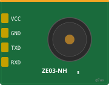

# Wokwi ZE03-NH3 Custom Chip

[](https://github.com/7ax/wokwi-chip-ze03-nh3/actions/workflows/build.yaml)
[](LICENSE)

Wokwi custom chip simulating the **Winsen ZE03-NH3** electrochemical ammonia gas sensor (UART module).

<p align="center">
  
</p>

## Usage

Add to your project's `wokwi.toml`:

```toml
[chips.ze03-nh3]
url = "github:7ax/wokwi-chip-ze03-nh3@1.0.0"
```

Then reference it in `diagram.json`:

```json
{
  "type": "chip-ze03-nh3",
  "id": "nh3",
  "attrs": { "nh3_ppm": "5" }
}
```

## Pin Connections

| ZE03-NH3 Pin | Connect To |
|---|---|
| VCC | 5V |
| GND | GND |
| TXD | MCU RX (e.g. ESP32 GPIO16) |
| RXD | MCU TX (e.g. ESP32 GPIO17) |

## Slider Control

Use the **NH3 (ppm)** slider (0-100 ppm, integer) to set the simulated ammonia concentration in real time.

## Protocol

UART: 9600 baud, 8N1

### Active Upload Mode (default)

Sensor transmits a 9-byte concentration frame every 1 second:

```
FF 86 [HIGH] [LOW] 00 00 00 00 [CHECKSUM]
```

Concentration (ppm) = HIGH x 256 + LOW

### Q&A Mode

Host sends read request, sensor responds:

```
Request:  FF 01 86 00 00 00 00 00 79
Response: FF 86 [HIGH] [LOW] 00 00 00 00 [CHECKSUM]
```

### Mode Switching

| Command | Bytes |
|---|---|
| Switch to Q&A | `FF 01 78 04 00 00 00 00 83` |
| Switch to Active | `FF 01 78 03 00 00 00 00 84` |
| Response (OK) | `FF 78 01 00 00 00 00 00 87` |

### Checksum

Two's complement of the sum of bytes 1 through 7:

```
checksum = (~(byte1 + byte2 + ... + byte7) + 1) & 0xFF
```

## Datasheet

[Winsen ZE03 User's Manual (PDF)](https://www.winsen-sensor.com/d/files/ze03.pdf)

## Building Locally

Requires [wasi-sdk](https://github.com/WebAssembly/wasi-sdk):

```bash
export WASI_SDK_PATH=/opt/wasi-sdk
make
```

Output: `dist/chip.wasm`

## License

[MIT](LICENSE)
